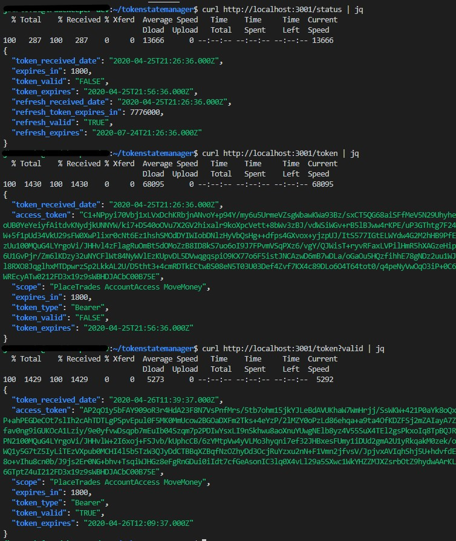

# Token State Server

## Description

Server API that maintains tokens associated to TDAmeritrade - see [developer.tdameritrade.com](http://developer.tdameritrade.com).  It sets ups two servers; one that can be seen from the outside to grab an authorization code from TDAmeritrade and an inside server accessible from localhost to be used anytime you need an updated token.  

Outside server: shows if the server is running and also provides a link to redirect to approval for code that can be used to exchange for a token.

Inside server: maintains the refresh and authorization token. 

## Usage

Update the code by using the external server and click on the link to take you to TDAmeritrade's authorization.  Point your browser to your redirect URL as registered at [developer.tdameritrade.com](http://developer.tdameritrade.com).  Once code is set than you can use the internal server to grab the latest token.

Whenever you need a valid token to access the TDAmeritrade API:
```
curl http://localhost:3001/token?valid
```
This will return JSON of a valid access_token.

## Installation

Database set up in /database through mysql model.  **Rename config.js.dist to config.js and modify as needed.**

```
NPM update
NPM start
```

*Firewalled setup with only external access to port 3000*


## Commands

External Server : 3000

Requires local authorization code to enter

/status
Https server that only shows status and no token info other than expire and date issue.

/code=?
The server also captures (as redirect) new Token Code from authorizing body to use to obtain both tokens and refresh tokens.

Internal Server : 3001

/help - shows available commands
/status - shows current status of server

/token - grabs last token issued
?valid - grabs a valid token (last issued or fetchs a new one)
?update - refreshes before returning token
?auto(0,1) - automatic update (NOT IMPLEMENTED)

/refresh - grabs last refresh token issued
?update - updates refresh token
?auto=(0,1) - automatic update (NOT IMPLEMENTED)


## Example systemd setup

located in `/lib/systemd/system/tokenstatemanager.service`
needs to be created by su and run by su as follows

To start systemd
```
sudo systemctl start tokenstatemanager
```

if you change the service file than you need to reload
```
sudo systemctl daemon-reload
```

To stop systemd
```
sudo systemctl stop tokenstatemanager
```

For Status to make sure its running
```
sudo systemctl status tokenstatemanager
```

Example service file setup for `/lib/systemd/system/tokenstatemanager.service`
```
[Unit]
Description=tokenstatemanager - managing state of oauth2 tokens
After=network.target

[Service]
WorkingDirectory=/home/ts_server/tokenstatemanager
Type=simple
User=ts_server
ExecStart=/usr/bin/node tokenStateServerRun.js

[Install]
WantedBy=multi-user.target
```

## Examples using the server



